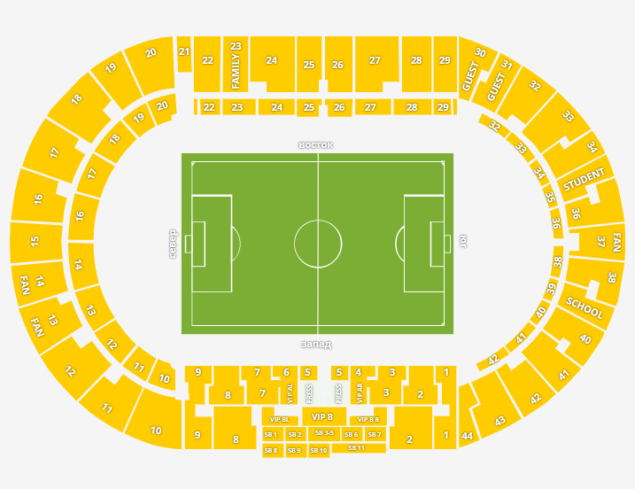
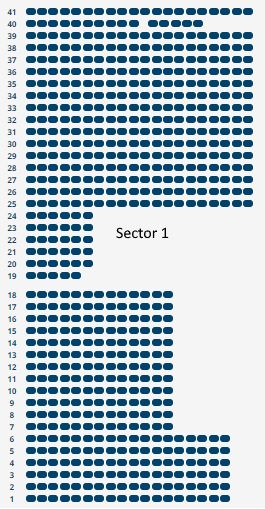

# Project: Metalist API
## Description: 
This is documantation Stadium Details.
## Additional documents for API
+ [Buy tikets Workflow](./buyTikets.md)
+ [Main Api Doc](./api.md)

### Stadium layout

### Sector №1 example

### Example seats for Api respose and request: "s1r9st9", 
" where 
s16- sector 16 
r9 - row 9
st9 - seat 9

### Description: Sectors and seats.

[Description Sectors](https://github.com/Skadabr/metalist/blob/master/server/stadium/metalist.js)